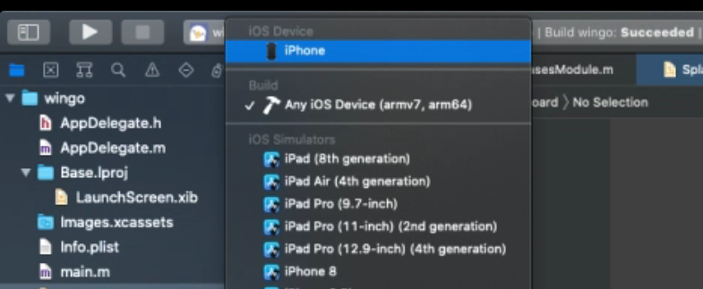
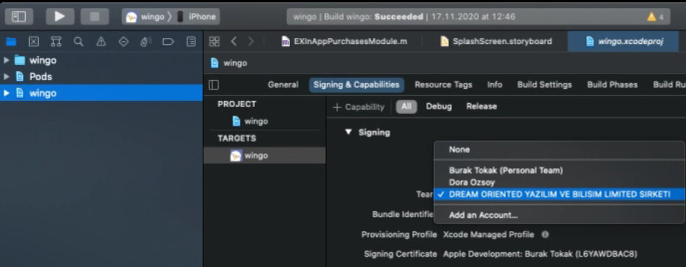

## Wingo

Getting started with this project;

```
git clone https://github.com/assistivecards/wingo
cd wingo

yarn install
```

Best node version: `v13.14.0`, any LTS would work. Would recommend installing nvm and using that exact version.

```
curl -o- https://raw.githubusercontent.com/nvm-sh/nvm/v0.37.0/install.sh | bash
nvm install 13.14.0
nvm use 13.14.0
```

Installs pods for iOS project, must be on macOS, you might also install npx globally

```
# npm install npx -g
npx pod-install
```

Now open the `ios` folder in xcode. (Open a project or file) Make sure you have the latest Xcode and respective ios version on your test device.

**EG:**
- For xcode version 12.1, Your test device (phoneos): 14.1
- For xcode version 12.2, Your test device (phoneos): 14.2

Wait for project to symlink, takes about 5-10 min.

Connect your phone or test device via USB :)

You can also choose to run the project on an iOS similator. Choose your phone or ios simulator in the topbar menu as shown in the screenshot below.



Choose wingo xcodeproj at the sidebar (highlighed in the screenshot below) change the tab to Signing & Capabilities. Choose "Auto Signing" and select dreamoriented as the team.



We need to add your Apple ID email to the team for this to show up. Meanwhile you can use your Personal Team to sign.

Now run the project. (Play button top left.) This will build an sign a development version of the app to your device, and will automatically start an react-native bundler. Now you can close the Xcode and for the next time, you can use the development app on your device just like expo. Everytime you open this development app, it will try to connect to the react bundler via local network.

For the next time to start the bundler without launching xcode run the command in the hub wingo path.

```
yarn start
# or
react-native start
```

Have fun!
